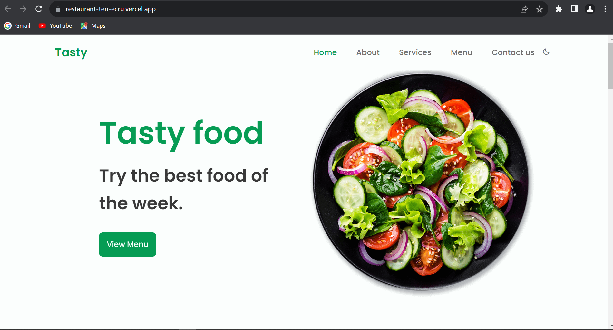
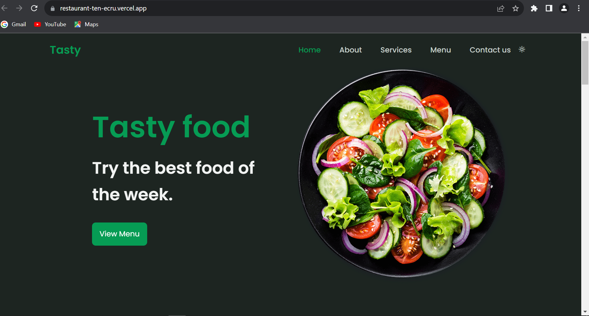

# Restaurant

# Restaurant Readme

# Toggle Between Light mode and Dark Mode





Welcome to the Restaurant Site, where we bring the aroma of the dishes, the warmth of a welcoming ambiance, and the sizzle of culinary expertise right onto your screen. Every line of code, every color choice, was an ingredient in a recipe for an exceptional user experience.

## Project Overview

From the smooth transitions to the crisp imagery, our goal was to make visitors feel like they had stepped into a culinary haven.

## Challenges and Resilience

Yet, in this artistic endeavor, challenges emerged—bugs in the code, design tweaks for optimal performance, and the occasional server hiccup. There were moments when the vision seemed just out of reach. Yet, every setback was a prompt to dust ourselves off and dive back in, armed with new knowledge and an unwavering determination.

## Table of Contents

1. [Getting Started](#getting-started)
2. [Features](#features)
3. [Usage](#usage)
4. [Contributing](#contributing)

## Getting Started

To explore our Food Site, simply visit [Food Site Demo](https://food-site-omega.vercel.app/).

## Features

- **Culinary Experience**: Immerse yourself in the world of culinary delight with our beautifully crafted website.
- **Smooth Transitions**: Enjoy smooth and engaging user experiences with our website's design.
- **Optimized Performance**: We've fine-tuned our design for optimal performance, ensuring a seamless visit.
- **Resilience**: We don't give up when faced with challenges. Our determination is unwavering.

## Contributing

If you want to contribute to our Food Site project, follow these steps:

1. Fork the repository to your GitHub account.

2. Clone the forked repository to your local machine:

   ```
   git clone https://github.com/yourusername/food-site.git
   ```

3. Create a new branch for your changes:

   ```
   git checkout -b feature/your-feature
   ```

4. Make your changes and commit them with descriptive commit messages.

5. Push your changes to your fork on GitHub:

   ```
   git push origin feature/your-feature
   ```

6. Create a pull request on the original repository to propose your changes.


Enjoy your culinary journey on our Food Site! If you have any questions or feedback, feel free to contact the project maintainers.
